# Asset Search Round 1 — 2026-10-01

Owner direction: existing authored assets replace procedural hero anatomy/furniture. Hair remains the game's density-field surface. Start with a modest normal quiff; no new shader features. None of these source pages grants instructions to change gameplay or make purchases.

## Human Character

| Candidate / preview | Source / creator | License / access | Polycount, rig and format | TARGET fit | Clear shortcomings / decision |
|---|---|---|---|---|---|
| **Snow v4** — 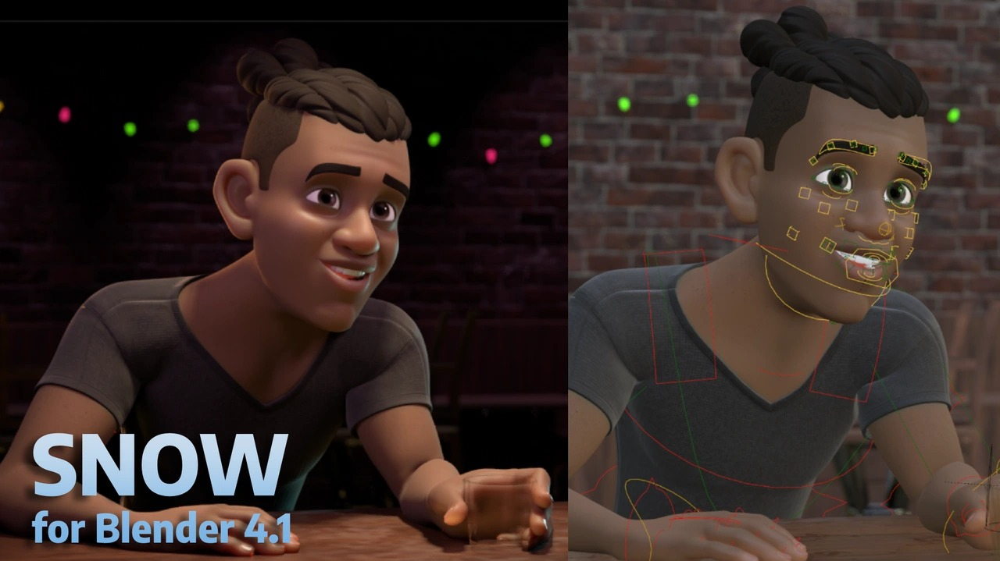 | [Blender Studio](https://studio.blender.org/characters/snow/v4/) | CC-BY 4.0, free; commercial/modification yes, credit required | Full face/body rig, pose library; .blend. Final posed export: **100,215 triangles**, 14 meshes | Integrated large eyes, sculpted cheeks/nose/mouth, expressive smile, continuous anatomy | Film rig cannot be assumed game-ready; needs pose evaluation, simpler materials, controlled subdivision. **Selected Hero and arms/body.** |
| **Rain v3** — 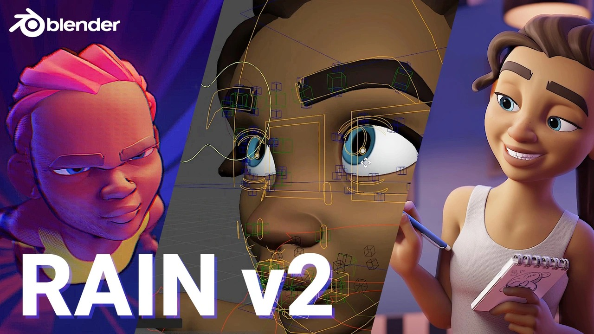 | [Blender Studio](https://studio.blender.org/characters/rain/v3/) | CC-BY 4.0, free; commercial/modification yes, credit required | Facial/body rig and pose library; .blend; exact original evaluated triangles unconfirmed | Excellent eye/cheek/mouth design; useful distinct teammate | Film-oriented rig, slender limbs, added adaptation cost. Downloaded; future visual variation candidate, not claimed integrated. |
| **Universal Base Characters Standard** — 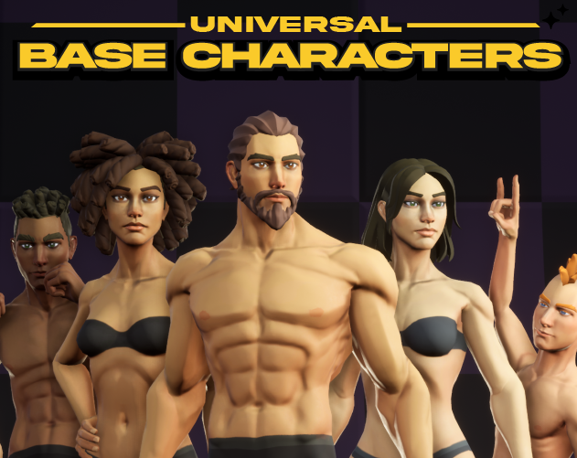 | [Quaternius](https://quaternius.itch.io/universal-base-characters) | CC0, free; commercial/modification yes; no credit requirement | Pack states ~13k tris average; humanoid rig; glTF/FBX. Free archive confirmed two Superhero full bodies + static hairstyles | Clean topology, real eye/face anatomy, straightforward Godot import | Athletic adult proportions and angular jaw are further from TARGET. Regular/Teen variants are paid Source, not part of this free download. Lightweight fallback, not chosen merely because CC0. |
| **Modular Male Heroes Cute Pro** — 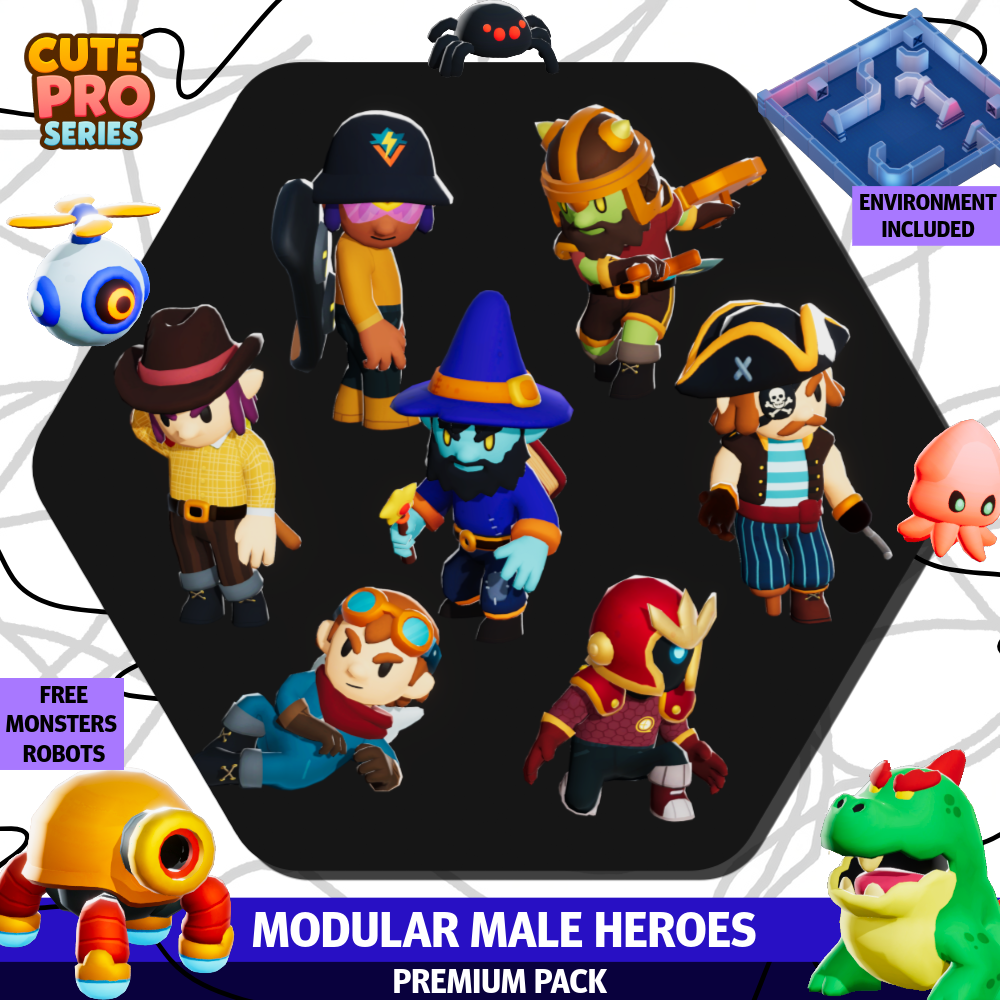 | [Meshtint](https://www.meshtint.com/products/modular-male-heroes-premium-pack) | Paid; commercial store license / Fab Standard option must be acquired before use; **not purchased** | ~2250 tris base, humanoid rig; no animations; FBX/Unity | Rounder limbs, appealing oversized head, coherent cartoon proportions | Fantasy costumes; simplified face less close than Snow; paid candidate retained. |
| **Sidekick Starter** — 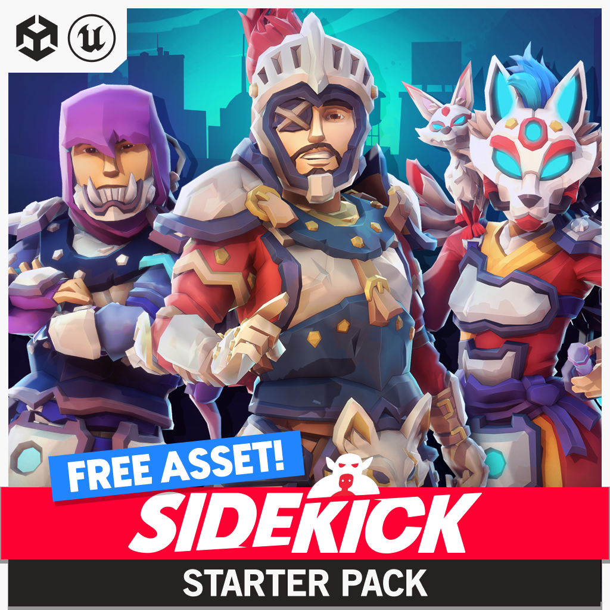 | [Synty](https://syntystore.com/en-gb/products/sidekick-modular-characters-starter-pack) | Free store acquisition, Synty One-Time Purchase EULA; commercial/customization supported, seat terms; not acquired | Rigged modular body, facial/body blend shapes; Unity package/UE content; polycount unconfirmed | Adjustable proportions and real expressions; hands/body share a visual language | Engine-specific assembly tooling and armored samples add adaptation; no need to introduce a new core asset pipeline for this Lab. |

## First-person Arms / Character Body

| Candidate / preview | Source and license | Rig / format / triangles | Fit | Drawback / decision |
|---|---|---|---|---|
| **Snow extracted forearm/hand** — [preview](asset-previews/snow.jpg) | Blender Studio, CC-BY 4.0, free; credit/modification notice required | Original finger rig and Hand Fist/Relaxed pose assets; .blend → GLB; final right arm **12,476 tris** | Same hand topology and skin palette as visible teammates; rounded joints and actual fingers | Grip must be posed for our clipper; current Lab export is a static grip. **Selected.** |
| **Universal Base Characters body arms** — [preview](asset-previews/ubc.png) | Quaternius, CC0 | Humanoid skeleton and finger joints; FBX/glTF; pack ~13k tris full body | Clean readily extractable body/arms, low import risk | More muscular anatomy, thin adult fingers relative to TARGET; fallback |
| **Stylized Hands VR and FPS** — 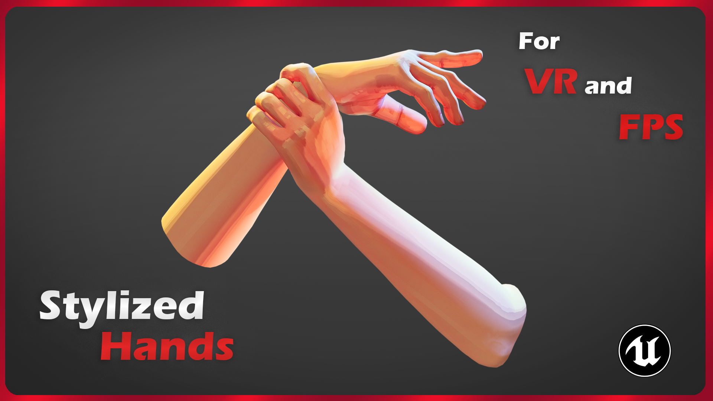 | [CC SAN / Fab](https://www.fab.com/listings/ba532903-d345-4c0e-9dd7-f1b6eb2a1904); commercial marketplace license candidate, exact acquisition tier/price not confirmed | Epic-compatible rig; Blender/FBX/UE; exact triangles unconfirmed | Purpose-built stylized hands, animation workflow, rounded form | Separate skin/anatomy language; paid/acquisition route not completed. Record only, no purchase or import |

Retro PSX arms (WRAD/Drillimpact) were also checked but excluded from the competitive shortlist: their deliberately faceted/retro finish is a poor target fit.

## Alpaca / Animal

| Candidate / preview | Source / license | Rig / formats / triangles | Fit | Drawback / decision |
|---|---|---|---|---|
| **Ultimate Animated Animals — Alpaca** — 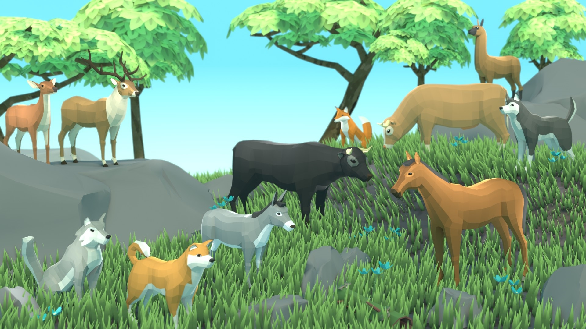 | [Quaternius](https://quaternius.com/packs/ultimateanimatedanimals.html), CC0, free | Rigged, animated source; glTF/FBX/OBJ/Blend. Final adapted body: **12,336 tris**, rig retained, source animations not exported | Authored camelid muzzle, ears, neck and quadruped structure; carries our separate fleece | Older faceted art direction and small eyes; needs smoothing/palette/proportion fitting. **Selected free base**, not claimed equal to TARGET's plush face |
| **Farm Animals** — 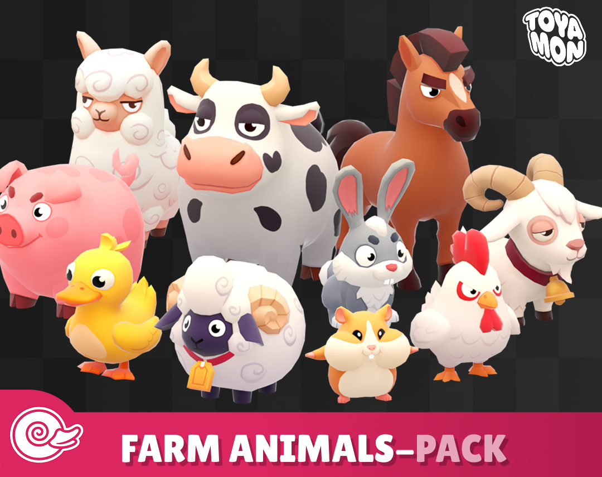 | [Toyamon](https://toyamonstudio.itch.io/farm-animals-pack), CC-BY 4.0 listing; **$14.99**, not purchased | Static, not rigged; FBX/glTF/OBJ; full preview scene 16k tris on creator's Sketchfab, per-animal unconfirmed | Best immediate round, plush, expressive animal visual match; includes alpaca/sheep | Static baked fleece must be separated from our editable volume; paid only recorded |
| **Animals Pack — Farm Animal** — 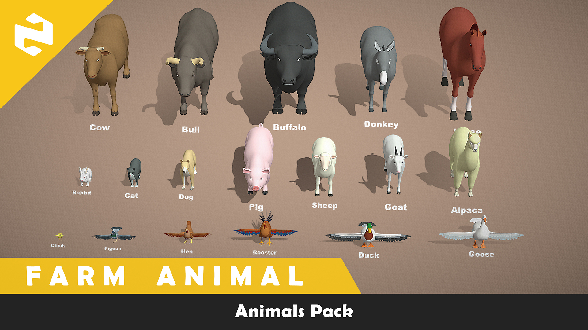 | [PolyOne Studio / Fab](https://www.fab.com/listings/e5d03e83-e0c7-409e-a7c8-fd6c884a7bb5), marketplace commercial license candidate, acquisition not completed | 18 animals; quad topology, UVs; rig-ready, not sold as rigged; Blend/Maya/FBX/OBJ/USD; triangles unconfirmed | Round camelid body, editable topology, simpler clean materials | More natural proportions and less expressive face; paid/license-tier selection pending, no import |

Rejected: Nyilonelycompany “Alpaca (Non-commercial)” has a conflict between its title and CC-BY label; toy scan/reupload provenance was also unclear. Neither is imported.

## Salon Environment / Hero Station

| Candidate / preview | Source / license | Geometry / formats | Fit | Drawback / decision |
|---|---|---|---|---|
| **Barber Shop Chair 01** — 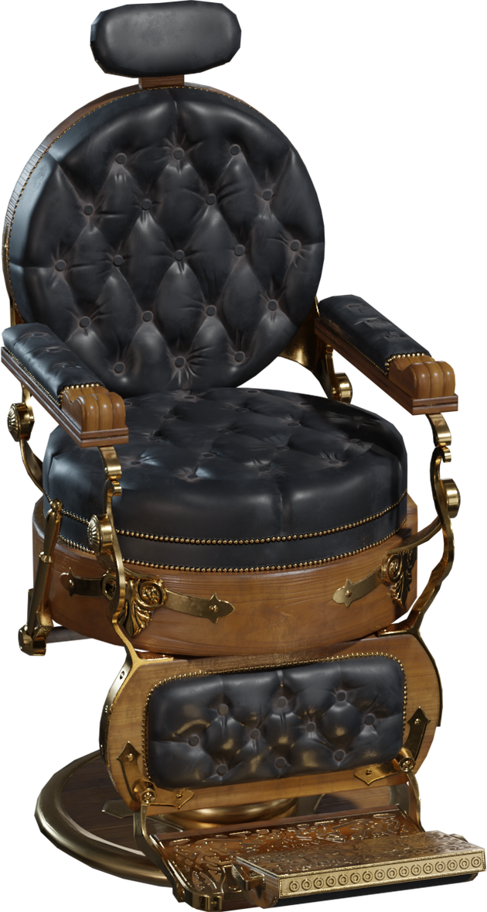 | [Fernando Quinn / Poly Haven](https://polyhaven.com/a/BarberShopChair_01), CC0, free | ~4k tris source display; static; Blend/glTF/FBX options. Exact adapted count in conversion manifest | Real barber silhouette: headrest, padded arms, footplate, mechanical base, rounded upholstery | Worn realistic finish conflicts with toy palette; recolor/reduce texture noise. **Selected hero chair.** |
| **Ultimate House Interior** — 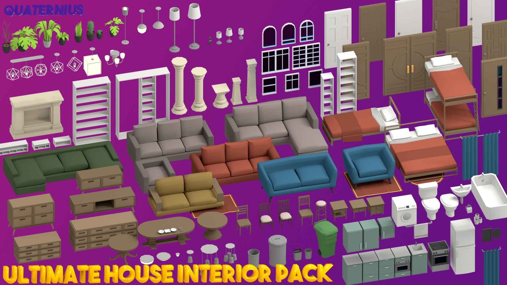 | [Quaternius](https://quaternius.com/packs/ultimatehomeinterior.html), CC0, free | Static; Blender/FBX/OBJ; selected meshes ~572–5580 tris after bevel | Cohesive counter, mirror, shelf, lamp, plant and stool vocabulary; individually editable | Older low-poly shading/materials require clean bevels and palette. **Selected supporting pack.** |
| **Furniture Kit 2.0** — 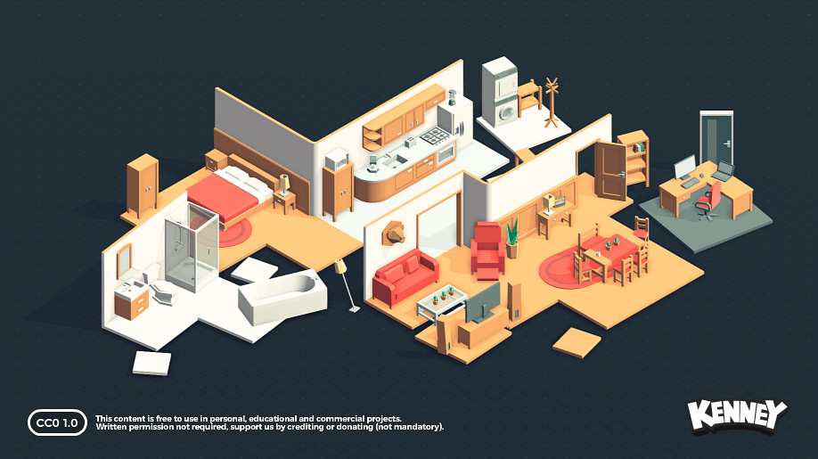 | [Kenney](https://kenney.nl/assets/furniture-kit), CC0, free | 140 static models; glTF/FBX/OBJ; exact selected count not measured | Coherent compact furniture and broad small-prop coverage | Simple silhouettes still closer to prototype than target hero furniture. Downloaded fallback, not runtime selection |
| **Barber Chair** — [interactive preview](https://sketchfab.com/3d-models/barber-chair-6458816e73534df0a26ddc6567395d2c) | Tyron / Omty, **CC-BY 4.0** | 24.3k tris / 12.5k vertices, 4k maps; rig/format not confirmed without download | Strong real padded chair structure, separated leather/metal/plastic maps | Sketchfab requires login. No login requested; continued to directly downloadable Poly Haven alternative |

## Visual iteration record

### Import round 1

Actual A/B/C × normal/crazy captures: `artifacts/asset-search-r1/render-1/`; `current-vs-target.jpg` is a side-by-side of actual gameplay output and supplied reference01. This early measurement overlaps the tail of initial asset import, so its timing is **not accepted performance evidence**. Godot tried to import research images with mismatched extensions; corrected the image files and excluded the research-preview directory via `.gdignore`.

Largest five gaps: (1) normal haircut oversized relative to new scalp; (2) jagged dark shading on imported skin/clothes; (3) temporary armchair hides seated anatomy; (4) imported supporting props lost their legacy colors; (5) composition underuses the customer's face and overemphasizes the foreground tool.

Next round is restricted to the first three: modest scalp-fitted quiff, shadow diagnosis, real licensed barber chair. No shader feature added.

### Rounds 2–4: actual import defects, not cosmetic shader compensation

- R2 (`render-2`): scalp-sized quiff; disabled-shadow diagnostic. Five largest gaps: skin patches persist, temporary chair, visible forearm cut, identical staring faces, flat/dim scene. Next three: isolate skin material/UV cause, finish real chair, improve camera/tool framing.
- R3 (`render-3`): pure-color skin diagnostic removed patches, real Poly Haven chair appeared. Five largest gaps: lost skin detail, oversized foreground tool, sparse/lost furniture palette, collar intersections, blank stares. Next three: correct source UV mapping, camera/tool scale, recover supporting prop palette.
- R4 (`render-4`): source `UVMap` replaces the accidentally selected tattoo-lighting UV; skin textures restored. Real chair, modest quiff and smaller tool appear in actual A/B/C. Five largest gaps: collar/shoulder intersection, visible FPS forearm cut, identical expressions/proportions, flat lighting, old giant hair root no longer fits this scalp. Next three: cloth/neck fit, continuous FPS arm, expressions/proportion and teammate color variation. Ordinary B actually hits the density surface at 2.489m within the existing 3m clipper reach.

R1–R4 are retained as intermediate evidence, not accepted final art. All images are actual Godot viewport captures; comparison sheets only resize and arrange them beside the supplied references.

### Round 5

`render-5` fixes the shoulder intersections and visible forearm cut by adapting the licensed meshes; relaxed eyelids and different shirt colors reduce the blank cloned appearance. Five largest gaps: harsh face shading/flat light, weak focal framing, giant roots oversized around the new scalp, thin adult anatomy, sparse salon dressing. Next three: correct shadow sampling/key-fill-rim balance, tighter A framing, fit the giant roots to the already established normal scalp. No new hair shader.

### Round 6 — retained regression

`render-6` has brighter subjects and scalp-fitted giant roots, but low shadow bias produces obvious stripe acne. Five largest gaps: shadow acne, giant crest cropped by the tighter A view, elevated teammate floating above the stool, thin adult anatomy, empty shelf/mirror styling. Next three: disable that defective spotlight shadow path, restore enough A distance for giant, seat the elevated teammate's feet on the existing imported stool. The failed shadow change is not retained because it technically supports shadows.

### Round 7 and animal import check

`render-7` removes the shadow-acne regression and fits the full crest in A. Remaining five: face/hair too dim relative to the room, teammate feet still below the actual stool seat, placeholder portrait head, adult body proportions, sparse furniture detail. Next three: subject-only warm bounce, measured stool-top placement, the same licensed face in the target portrait. Normal is now the default interactive preset; giant remains an explicit comparison.

`animal-1` is a failed import validation, not usable animal art: subdivision on the split glTF vertices shrank each face separately. Next three for that fixture: weld coincident vertices before subdivision, enlarge authored facial anatomy, raise fleece to reveal eyes/muzzle. The original rig is retained; imported debug-bone helper geometry is excluded. Its source download stays unchanged.

### Round 8 and final asset conversion

`render-8` adds subject-only warm bounce, correct stool height and the actual licensed head in the target card. Five largest gaps: face still unexpectedly faceted, animal ears/eyes too hidden, adult human proportions, simple hair flow, sparse room. Next three: fix source subdivision-control drivers, expose animal ears/eyes using the existing mesh, recheck body/face proportion at final resolution. The original film rig's viewport drivers were overriding explicit subdivision levels; the final converter controls that export state and enables render correctives. Face/body/shirt use one subdivision, small teeth/shoes stay lower. Final counts supersede the initial 50k-body / 3k-arm figures.

`animal-2` verifies the welded body is continuous and the muzzle is visible. Its short timing sample overlapped an inspection process and is not final performance evidence. Final animal capture is repeated in isolation.

## Final Round 1 evidence and art judgment

- [Normal BeautyMatchCamera](../artifacts/asset-search-r1/final-human-color/ordinary-A.png), [real FPS](../artifacts/asset-search-r1/final-human-color/ordinary-B.png), [store view](../artifacts/asset-search-r1/final-human-color/ordinary-C.png).
- [Human CURRENT vs TARGET, A/B/C × normal/crazy](../artifacts/asset-search-r1/final-human-color/comparison.jpg).
- [Same geometry with simple gray hair](../artifacts/asset-search-r1/final-human-gray/comparison.jpg).
- [Animal CURRENT vs TARGET](../artifacts/asset-search-r1/final-animal-color/comparison.jpg).

The authored continuous face, fingers and real barber chair replace the generated hero mannequin and furniture. The normal quiff is readable without a hair shader. **The reference's overall quality is not matched yet.** Snow is a viable human integration candidate; the free Quaternius animal remains a lower-quality fallback, not accepted final Hero art. Toyamon is a stronger visual animal candidate but is paid and was not purchased. Rain is downloaded but not integrated. The present models are posed fixtures; no animation controller or production B character replacement is claimed.

Largest remaining five, based on the actual side-by-side:

1. Facial expression, gaze and adult body proportions remain much less appealing/dynamic than the reference; the two teammates still share one base character.
2. Human hair has a readable quiff but lacks the reference's grouped locks and intentional flow; giant volume still reads too soft in places. Prioritize normal hair before more giant polish.
3. Animal face/neck silhouette and eyelids are well below the plush target; don't retain this choice as final merely because it is free and technically imported.
4. Room is sparse, mirror is a tinted surface, shelves are empty, and the flat lighting lacks soft contact/bounce. The defective spotlight shadows are disabled; no unsupported renderer feature is assumed.
5. Posed helpers are not yet doing convincing work, and C still has too much empty floor for a final store screenshot.

The next art pass should address **1–3 only**, with licensed anatomy/pose adaptation and additional animal scouting or an owner-acquired stronger animal base. Do not add hair states, shader features, gameplay or a full-level rollout to cover these gaps.

### Actual checks

- Build/import: `build-final.log`, exit0. Frozen Debug DLL SHA256 `6CA51F20FC914D38365C2904B9EB7951D7D86EC8B5862E49F9D1F1D95F13A7C1`.
- Core: `core-tests.log`, **248/248**; `core-invariance.json`: all **94 Core files unchanged**.
- Native Lab input: `controls.log`, F1/F2/F3/F4/F5/F6/Tab/W/Escape/F12, actual imported hero/chair/arm presence, named BeautyMatchCamera, accessible CC-BY credit, finite normals and exact gray/mesh rollback; exit0.
- Actual rendered B WorldChecks: `b-world.log`, `EXPANSION_13_ENGINE_OK`, exit0. No network/WAN performance claim; no network code/protocol was changed.
- Final human color: 1.323–2.087ms average frame, 0.343–0.581ms measured GPU,146–164 draw calls. Gray:1.532–1.806ms frame. Alpaca:1.471–1.910ms frame. RTX5070Ti Laptop,1280×800,Compatibility,vsync off,1sec warmup+2sec samples/shot, static scene/no simulation. These are **short isolated render samples**, not full-game or multiplayer budgets.
- Real B camera remains73°/1.7m. Density hits within existing3m reach: human normal2.489m/giant2.449m; animal normal2.316m/giant2.107m. This measures geometry, not live cutting gameplay.
- Candidate manifests include source, DLL, exporter, GLBs, attribution and export settings. Earlier `triangles` metric meant hair triangles only; final output names it `hairTriangles` and separately reports `renderPrimitives`.
- Exported PCK validation passed in a separate empty directory: `license-packed-check.log`, `PACKED_ASSET_LICENSES_OK 6`. Attribution and five original license records were actually read from the pack. Export wrapper initially waited on its own idle VBCSCompiler's inherited output pipe; stopping that identified compiler released the completed exit0 export. Debug DLL hash remained unchanged. This is a license-pack check, not a newly delivered full-game release.

### Run / rollback

```powershell
pwsh -NoProfile -File scripts/build.ps1
pwsh -NoProfile -File scripts/visual_target_lab.ps1 -Interactive -Color
# Add -Animal for the animal fixture. Omit -Color for simple gray hair.
# Omit -Interactive to capture A/B/C automatically for both shapes.
pwsh -NoProfile -File scripts/test.ps1
pwsh -NoProfile -File scripts/run_b.ps1
```

F1/F2/F3 cameras; F4 normal/crazy; F5 gray/color; F6 credits; Tab grounded visual navigation; Escape releases pointer; F12 saves. Source B gameplay remains the ordinary run script. Existing packaged builds were not replaced. No purchase, login, static third-party customer hairstyle or shader addition.
